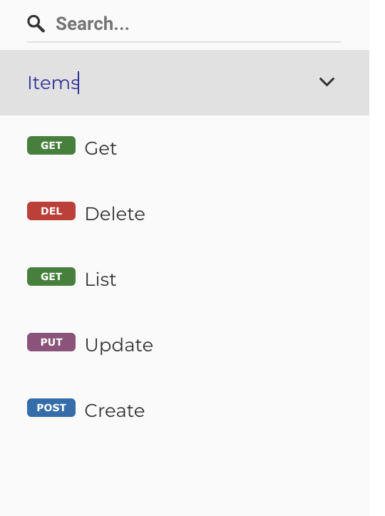

# Quick Start

Install FuriousAPI and extend your FastAPI project with the power of DRF's design patterns:

```bash
pip install fastapi furiousapi
```

To include database support, pick the extension that suits your needs:

```bash
pip install "furiousapi[sqlmodel]" # For SQLModel integration
pip install "furiousapi[beanie]"   # For MongoDB with Beanie
```

Define a model and create a `ModelController` to handle API interactions:

```python
from typing import Annotated

import uvicorn
from fastapi import FastAPI, Depends
from sqlalchemy.ext.asyncio import create_async_engine
from sqlmodel import SQLModel, Field
from sqlmodel.ext.asyncio.session import AsyncSession

from furiousapi.api import ModelController
from furiousapi.sqlmodel import SQLRepository

# app_dependencies.py
engine = create_async_engine("sqlite+aiosqlite:///test_db.sqlite")


async def sql_session() -> AsyncSession:
    async with AsyncSession(engine, expire_on_commit=False) as session:
        yield session


SessionDep = Annotated[AsyncSession, Depends(sql_session)]


# items/models.py
class Item(SQLModel, table=True):
    id: int = Field(default=None, primary_key=True)
    name: str
    description: str = Field(default=None, nullable=True)


# items/repository.py
class ItemRepository(SQLRepository[Item]):
    pass


# items/dependencies.py
def repository(session: SessionDep) -> ItemRepository:
    return ItemRepository(session)


# routes.py
class ItemController(ModelController, prefix="/item", tags=["Items"]):
    repository = Depends(repository)


# app.py
app = FastAPI()
app.include_router(ItemController.api_router)

if __name__ == '__main__':
    uvicorn.run(app)
```

This sets up a basic CRUD API for the `Item` model with minimal code.



### Get


### Create


### Update


### Delete


### List


For detailed instructions and best practices, visit our [Tutorial](./tutorial.md) section.
